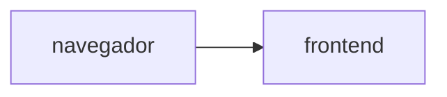

# Muro de mensajes

**Equipo:**
**Proyecto de Google Cloud:**
**URL del muro:**

## Diagrama

## Fase 0. Preparación

## Fase 1. Las imágenes

## Fase 2. Los cimientos

## Fase 3. El backend

## Fase 4. El frontend, conectado

## Fase 5. El estado vive afuera

## Fase 6. Reto

### Decisiones

### Preguntas
